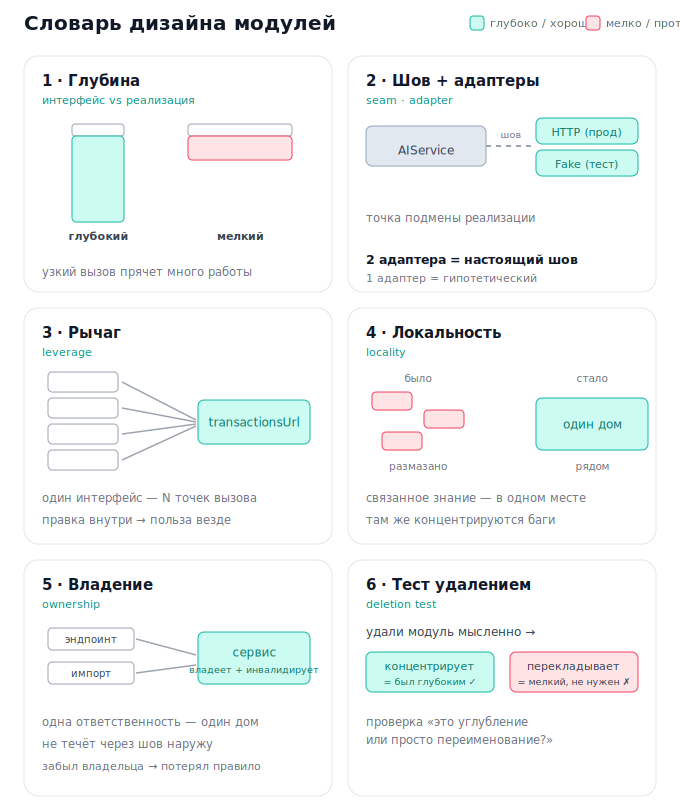

# Словарь дизайна модулей

Терминология, которой пользуются грилинг- и архитектурные ревью-сессии
(`/improve-codebase-architecture`, `/codebase-design`). Корни — John Ousterhout,
«A Philosophy of Software Design» (глубина, интерфейс vs реализация) + понятие
«шва» из Michael Feathers, «Working Effectively with Legacy Code». Примеры взяты
из истории этого репозитория.

---

## Базовая пара: модуль, интерфейс, реализация

**Модуль** — единица кода как «чёрный ящик»: функция, класс, хук, файл-сервис.
`transactionsUrl`, `ChartService`, `useRuleDraft` — всё это модули.

- **Интерфейс (поверхность)** — то, что должен знать вызывающий: сигнатура, имена,
  типы, требуемый порядок вызовов. Контракт снаружи.
- **Реализация** — то, что внутри и о чём знать не надо.

«Поверхность» = размер интерфейса. Больше знать снаружи (флаги, неявные правила
«сначала X, потом Y») → **шире поверхность** → выше когнитивный налог.

## Глубина: глубокий против мелкого

Центральная метрика. **Глубина = сколько полезной работы модуль прячет за
поверхностью.**

- **Глубокий модуль** — узкий интерфейс, много реализации. Простой вызов → много
  спрятанной сложности.
- **Мелкий (shallow) модуль** — интерфейс почти как реализация. Ничего не прячет,
  только добавляет прослойку. Опасны числом: каждый добавляет то, что надо выучить,
  не давая взамен спрятанной сложности.

Примеры:
- `transactionsUrl(criteria)` — **глубокий**: вызов на строку, внутри вся грамматика
  URL. Пять страниц перестали её знать.
- `ChartService.ChartCashFlowAsync(period)` — **глубокий**: прячет дедуп Sankey-нод,
  помесячную разбивку, баланс потоков.
- `useUpsertResource<T>` (отвергли) был бы **мелким**: обёртка на 12 строк над тем,
  что и так 12 строк.

## Шов (seam)

**Место, где можно подменить реализацию, не трогая код вокруг.** Хороший шов =
место, где тест «цепляется» к модулю (**интерфейс — это тестовая поверхность**).
Нет шва → чтобы протестировать логику, тащишь весь мир (реальный HTTP, реальную БД);
«untestable» и «нет шва» — синонимы.

Пример: **AI transport seam** (ADR-0011). До — `AIService` сам делал HTTP через
`static HttpClient`, шва не было. Ввели `IChatCompletion`: в проде HTTP-адаптер, в
тестах — фейк, код `AIService` не меняется.

## Адаптер + правило «два адаптера = настоящий шов»

**Адаптер** — конкретная реализация за швом (`HttpChatCompletion` → OpenAI-совместимый
HTTP; `FakeChatCompletion` → канированный ответ в тесте).

Правило (ADR-0003): **один адаптер = гипотетический шов, два = настоящий.** Одна
реализация без предвидимой второй → интерфейс не оправдан, преждевременная абстракция.

- AI-шов **оправдан**: прод-HTTP + тестовый фейк.
- `IRepository` над `IDbContextFactory` **отвергли**: фактори уже сам шов, второго
  адаптера нет.
- Фабрику AI-провайдеров **отвергли**: OpenAI/DeepSeek/GLM wire-совместимы, все три
  обслуживает один адаптер.

## Рычаг (leverage)

**Во скольких местах срабатывает один интерфейс.** Один модуль × N вызывающих.
Правка внутри → польза во всех N. `transactionsUrl` — рычаг 6; `chartOptions` — ×7
страниц. Один потребитель → рычага нет → извлечение слабо оправдано.

## Локальность (locality)

**Насколько связанное знание собрано в одном месте.** Высокая локальность — понять/
изменить одну вещь смотришь в один модуль, а не прыгаешь по пяти файлам. Там же
концентрируются баги.

- До кандидата №3 агрегация графиков жила в двух домах (`DataService.Chart.cs` +
  инлайн в `ChartEndpoints`); после — один `ChartService`.
- `isUncategorizedCategory` (№5) собрал правило в один предикат → рассинхрон регистра
  стал невозможен.

Тонкость: локальность иногда противоречит «мелким модулям ради тестируемости».
Выдёргивать чистую функцию, когда баги сидят в том, *как её вызывают* (а вызов остался
непокрытым) — плохо. Лучше глубокий модуль с локальной логикой, чем россыпь огрызков.

## Владение (ownership)

**У какого модуля единственная ответственность за правило/данные/инвариант.** «Кто
владеет X» → «все идут сюда, и только здесь X меняется».

- `ReferenceDataCache` владеет in-memory Accounts/Categories и их инвалидацией.
- Кандидат №7: `CategoryEndpoints.Delete` лез в EF напрямую и **забыл** инвалидацию —
  нарушил владение. Вернули правило **эндпоинты владеют HTTP, сервисы — персистентностью**;
  как только delete пошёл через `DeleteCategoryAsync`, инвалидация вернулась «бесплатно».
- Контракт ошибок AI: **адаптер владеет транспортными сбоями**, **сервис — конфиг-сбоем**.

## Тест удалением (deletion test)

Проверка «углубление или перекладывание». **Мысленно удали модуль: сложность
сконцентрируется или просто переедет?**

- «Концентрирует» → модуль был глубоким, извлечение оправдано.
- «Переедет/размажется» → мелкая обёртка, толку мало.

Так отсекли дробление `DataService` на per-entity сервисы (Account/Category CRUD —
3–4 тонких метода: удали «AccountService» — сложность лишь переименуется). А `ChartService`
тест проходит: убери — 379 строк агрегации размажутся обратно.

---

## Как это связано

> Хороший дизайн = **минимум суммарной поверхности** при **максимуме спрятанной
> сложности**. Швы — там, где реально ≥2 адаптера. Модулям — чёткое **владение** (одно
> правило, один дом). Гонимся за **рычагом** и **локальностью**, избегаем **мелких**
> модулей (проверка — **тест удалением**).

Чек-лист для каждого кандидата на извлечение:

1. **Глубина** — интерфейс уже реализации? (иначе мелкий → не делать)
2. **Шов** — есть ≥2 адаптера? (иначе гипотетический → не абстрагировать)
3. **Рычаг** — сколько вызывающих? (1 → слабо оправдано)
4. **Локальность** — правило соберётся в один дом?
5. **Владение** — чья единственная ответственность? не течёт ли через шов?
6. **Тест удалением** — сконцентрирует сложность или переложит?
